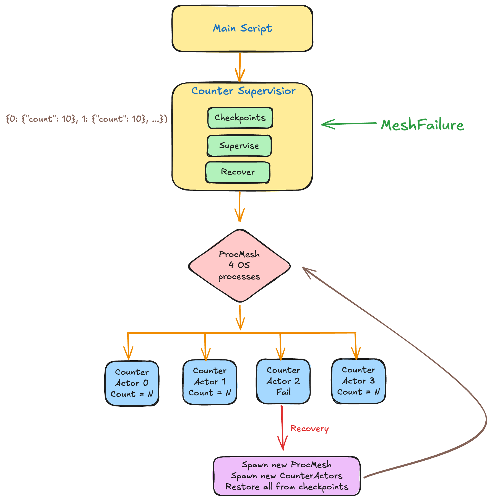

# Fault-Tolerant Counter Service Demo

Demonstrates Monarch's fault tolerance using a simple stateful counter actor.



## What It Does


A `CounterSupervisor` manages a mesh of `CounterActor` instances and walks through the full fault-tolerance lifecycle:

1. Spawn 4 counter actors via the supervisor
2. Increment all counters 10 times
3. Checkpoint actor state through the supervisor
4. Kill one actor's process with SIGKILL to simulate a crash
5. Supervisor detects the failure via `__supervise__`
6. Respawn actors on a fresh ProcMesh and restore from checkpoint
7. Continue counting — no data lost

## Monarch Concepts Covered

- **Actor / @endpoint** — defining stateful services
- **ProcMesh / ActorMesh** — spawning actors across processes
- **Supervision trees** — `__supervise__` for catching mesh failures
- **Checkpoint / restore** — saving and recovering actor state
- **Mesh ownership** — failures propagate to the owning actor automatically

## Running

```bash
python examples/fault_tolerance_demo.py
```
